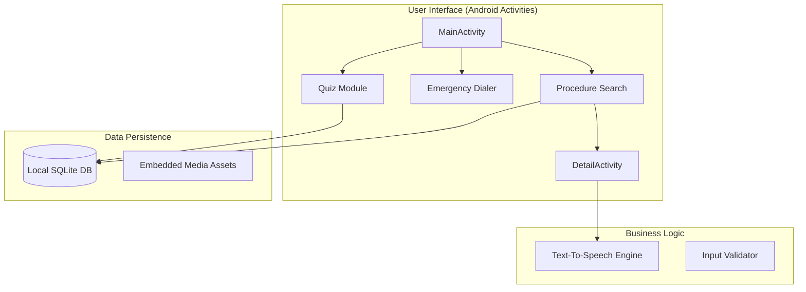

# FirstAid+ 🚑

> **Empowering the "Golden Hour": Zero-Latency Emergency Medical Companion for Kenya.**

FirstAid+ is an offline-first, native Android application engineered to provide instant access to life-saving medical protocols. Designed specifically for high-stress environments and network-constrained regions, it ensures that critical first-aid information is always just one tap away.


---

## 🌟 Key Features

### 📡 Offline-First Intelligence
Built with a local **SQLite** core, all medical instructions, diagrams, and assets are embedded directly into the device. No internet? No problem. The app works flawlessly in rural blackspots and on long highway stretches.

### 🆘 One-Touch Emergency Response
In a crisis, every second counts. The integrated **Emergency Dialer** allows users to instantly connect with national emergency services (999/112) using a high-visibility, single-tap interface.

### 🧠 Interactive Learning (Quiz Module)
Beyond emergencies, FirstAid+ acts as an educational tool. The gamified **Quiz Module** allows users to test their knowledge and improve their preparedness during downtime.

### 🛡️ High-Stress UI/UX
Designed with a "Medical Red" high-contrast theme and oversized touch targets. The interface is optimized to minimize cognitive load and prevent accidental clicks when the user is in a state of panic.

---

## 🏗️ Architecture



---

## 🛠️ Technical Stack

| Component | Technology |
|-----------|------------|
| **Core** | Native Android (Java) |
| **Database** | SQLite |
| **Minimum SDK** | API 24 (Android 7.0) |
| **Target SDK** | API 33 (Android 13.0) |
| **UI Library** | Material Components for Android |
| **Accessibility** | Android Text-To-Speech (TTS) |

---

## 🚀 Getting Started

### Prerequisites
- Android Studio Hedgehog or newer
- JDK 11+
- Android Device/Emulator (API 24+)

### Installation
1. Clone the repository:
   ```bash
   git clone https://github.com/team-jar/FirstAidPlus.git
   ```
2. Open the project in **Android Studio**.
3. Let Gradle sync dependencies.
4. Run the `app` module on your device.

---

## 👥 The Team: JAR

Developed as a capstone project by undergraduate students at **Jomo Kenyatta University of Agriculture and Technology (JKUAT)**, pursuing a **BSc in Data Science and Analytics**.

| Name | Registration Number |
|------|---------------------|
| **Joseph Lperen Arigele** | SCT213-C002-0105/2023 |
| **John Apollos Olal** | SCT213-C002-0080/2023 |
| **Roselida Aloo** | SCT213-C002-0118/2023 |

---

## 📄 License
This project is licensed under the MIT License - see the [LICENSE](LICENSE) file for details.

---
*Created with ❤️ by Team JAR in Nairobi, Kenya.*
