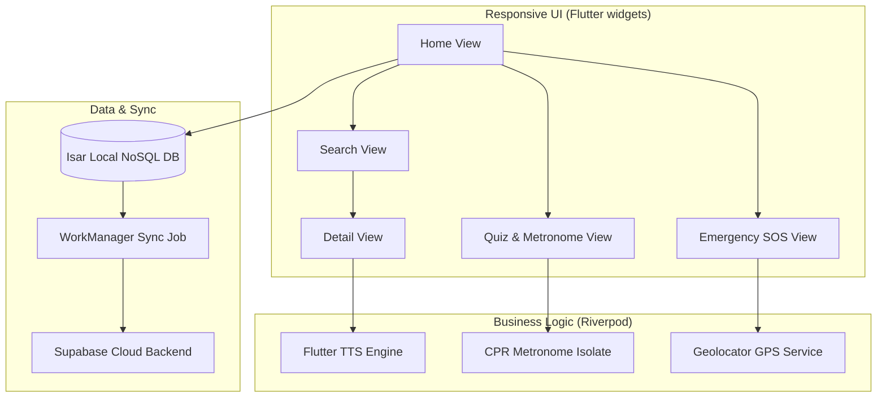

# FirstAid+

> **Empowering the "Golden Hour": Zero-Latency Responsive Emergency Companion for Kenya.**

FirstAid+ is an offline-first, cross-platform mobile application built using Flutter, engineered to provide instant access to life-saving medical protocols. Designed specifically for high-stress environments, rural areas, and network-constrained regions in Kenya, it scales seamlessly across mobile devices, tablets, and foldables, supporting both English and Kiswahili.

---

## Key Features

### Offline-First Isar NoSQL Engine
Powered by an ultra-fast Isar NoSQL database, all procedures, instructions, diagrams, and questions are cached locally. Full-text indexing provides sub-millisecond search results instantly as the user types.

### Dual-Language and Swahili Voice Guidance
The entire UI transitions instantly between English and Kiswahili. The built-in voice guidance (Text-to-Speech) automatically adjusts to Swahili (`sw-KE`) to assist users hands-free during emergency scenarios.

### Adaptive Multi-Pane and Foldable Layouts
The UI adjusts dynamically to all form factors:
- **Phones**: Single-column vertical scroll.
- **Tablets and Foldables (>600dp)**: Automatic dual-pane Master-Detail layout.
- **Hinge Crease Offset**: Automatically shifts interactive buttons away from physical folds in foldable devices.

### Isochronous CPR Metronome
A high-precision periodic timer running independently of the main UI thread. It flashes the screen (Cyan to Charcoal) and emits a sharp audio click at exactly 110 bpm to guide rescuers in real-time resuscitation.

### Smart GPS Location and SOS Fallback
Reads live coordinates (Latitude, Longitude, Altitude) offline directly from the device's internal GPS. Features a one-tap SOS trigger to call the Kenya Red Cross Society EPlus Ambulance (`1199`) and auto-fill an SMS with coordinates for the dispatch center.

### Data Science Telemetry and Supabase Sync
Gathers anonymized, encrypted user metrics (searches, completed procedures, quiz results) in a local Isar queue. When connected to Wi-Fi and charging, a background worker automatically uplinks telemetry logs to a central Supabase PostgreSQL instance.

---

## Architecture



---

## Technical Stack

| Component | Technology |
|-----------|------------|
| **Framework** | Flutter (Dart) |
| **Local Database** | Isar NoSQL |
| **Backend / Sync** | Supabase |
| **State Management** | Riverpod |
| **Localization** | `flutter_localizations` (.arb files) |
| **Location Engine** | `geolocator` |
| **Background Sync** | `workmanager` |

---

## Getting Started

### Prerequisites
- **Flutter SDK** (stable branch)
- **Dart SDK**
- **Android Studio / Xcode** (for compiling native packages)

### Installation
1. Clone the repository:
   ```bash
   git clone https://github.com/team-jar/FirstAidPlus.git
   ```
2. Navigate to the project folder:
   ```bash
   cd FirstAidPlus
   ```
3. Fetch dependencies:
   ```bash
   flutter pub get
   ```
4. Run compiler generators for Isar:
   ```bash
   dart run build_runner build
   ```
5. Deploy to a connected device:
   ```bash
   flutter run
   ```

---

## Venture Team

FirstAid+ is designed, developed, and maintained under the **Apollos Digital Solutions** venture:

* **John Apollos Olal** (Lead Software Engineer & Data Scientist): Responsible for cross-platform Flutter architecture, NoSQL database engineering, and offline telemetry pipeline.
* **Joseph Lperen Arigele** (Ventures Strategist & Regional Liaison): Responsible for operational deployment, Red Cross partnership alignment, and county integration strategy.

---

## Future Roadmap

The following features and enhancements are planned for upcoming releases of FirstAid+:

* **Drift-Free CPR Metronome**: Re-implementation of the audio/visual metronome using a hardware VSync-bound `AnimationController` to guarantee microsecond synchronization under heavy UI threads.
* **Responsive Multi-Viewport Overhaul**: Integration of adaptive content constraints (maximum content width of 800dp) and side-by-side grid layouts on wide tablets, landscape viewports, and unfolded foldable screens.
* **Gamified CPR Pace Tester**: Integration of a real-time tap recorder that calculates resuscitator compression intervals, giving immediate feedback on compliance with the 110 BPM guideline.
* **Branched Rescue Scenarios**: Interactive situational training paths replicating real-world emergency decision trees.
* **Offline County Directory**: Built-in telephone database for regional Kenya Red Cross Society offices and county hospital dispatch lines.
* **Paramedic Medical ID Profile**: Local secure storage allowing users to pre-fill blood group, allergies, and emergency contact details for scene responders.

## License
This project is licensed under the MIT License - see the LICENSE file for details.

---
*Developed by Apollos Digital Solutions in Nairobi, Kenya.*
