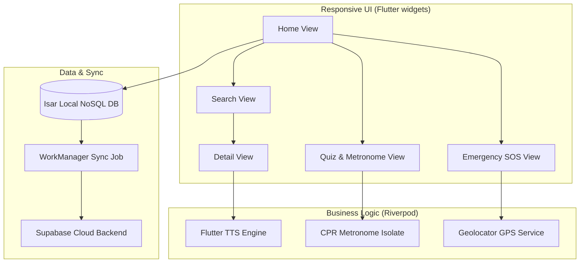

# FirstAid+

> **Empowering the "Golden Hour": Zero-Latency Responsive Emergency Companion for Kenya.**

FirstAid+ is an offline-first, cross-platform mobile application built using Flutter, engineered to provide instant access to life-saving medical protocols. Designed specifically for high-stress environments, rural areas, and network-constrained regions in Kenya, it scales seamlessly across mobile devices, tablets, and foldables, supporting both English and Kiswahili.

---

## Key Features

### Offline-First Isar NoSQL Engine & Extensible Translations
Powered by an ultra-fast Isar NoSQL database, all procedures, instructions, diagrams, and questions are cached locally. Uses a multilingual `LocalizedText` data schema supporting English, Kiswahili, and Somali (`so`) with dynamic, regional fallback logic.

### Multilingual Voice Guidance
The entire UI transitions instantly between English, Swahili, and Somali. Built-in voice guidance (Text-to-Speech) automatically sets matching locales (`en-US`, `sw-KE`, `so-SO`) to assist users hands-free during critical events.

### Adaptive Multi-Pane, Foldable & Tablet Constraints
The UI adjusts dynamically to all form factors:
- **Phones**: Single-column vertical layouts.
- **Tablets and Foldables (>600dp)**: Automatic dual-pane Master-Detail viewports.
- **Tablet Constraints**: Restricts layouts on Emergency and Metronome screens to a maximum content width of 800dp in landscape viewports to maintain premium visual aesthetics.
- **Hinge Crease Offset**: Automatically shifts interactive buttons away from physical display creases.

### CPR Metronome & Interactive Pace Tester
- **Isochronous Metronome**: A precise periodic timer flashing the screen (Cyan to Charcoal) at exactly 110 bpm.
- **Pace Tester**: An interactive tapping pad that measures resuscitator compression intervals in real-time, giving instant color-coded feedback (`TOO SLOW`, `PERFECT CPR PACE`, `TOO FAST`) and streak counters with light haptic impacts.

### Two-Tier Regional SOS & Offline Directory
- **Regional SOS Routing**: Dynamic SOS dialers that route calls to the local Kenya Red Cross regional office dispatch line (e.g. Northern Region Office `+254 722 000 001`) if configured, falling back to national EPlus `1199`.
- **Offline Referral Directory**: Searchable local index of KRCS regional offices, camp clinics, and level 4/5 county referral hospitals.
- **Medical ID (ICE) Profile**: Locally saved emergency card storing name, blood group, allergies, and contacts for first responders.

### KDPA 2019 Telemetry Consent & Supabase Sync
- **KDPA 2019 Privacy Consent**: An onboarding trilingual modal prompts users on first boot. Analytics logging is completely disabled unless explicit consent is granted.
- **Supabase Sync**: Telemetry queues write to Isar offline and sync automatically with Supabase PostgreSQL over background workers when connected to Wi-Fi.

---

## Architecture



---

## Technical Stack

| Component | Technology |
|-----------|------------|
| **Framework** | Flutter (Dart) |
| **Local Database** | Isar NoSQL |
| **Backend / Sync** | Supabase |
| **State Management** | Riverpod |
| **Localization** | `flutter_localizations` (.arb files) |
| **Location Engine** | `geolocator` |
| **Background Sync** | `workmanager` |

---

## Getting Started

### Prerequisites
- **Flutter SDK** (stable branch)
- **Dart SDK**
- **Android Studio / Xcode** (for compiling native packages)

### Installation
1. Clone the repository:
   ```bash
   git clone https://github.com/team-jar/FirstAidPlus.git
   ```
2. Navigate to the project folder:
   ```bash
   cd FirstAidPlus
   ```
3. Fetch dependencies:
   ```bash
   flutter pub get
   ```
4. Run compiler generators for Isar:
   ```bash
   dart run build_runner build
   ```
5. Deploy to a connected device:
   ```bash
   flutter run
   ```

---

## Venture Team

FirstAid+ is designed, developed, and maintained under the **Apollos Digital Solutions** venture:

* **John Apollos Olal** (Lead Software Engineer & Data Scientist): Responsible for cross-platform Flutter architecture, NoSQL database engineering, and offline telemetry pipeline.
* **Joseph Lperen Arigele** (Ventures Strategist & Regional Liaison): Responsible for operational deployment, Red Cross partnership alignment, and county integration strategy.

---

## Future Roadmap

The following features and enhancements are planned for upcoming releases of FirstAid+:

* **Branched Rescue Scenarios**: Interactive situational training paths replicating real-world emergency decision trees.
* **Offline First-Aid Kit Checklist**: Asset checklist helping regional clinics track stock levels of bandages, splints, and antiseptics.
* **Digital Certification**: Automatically generate a shareable PDF certificate of first aid training upon getting a perfect score on all quiz modules.

## License
This project is licensed under the MIT License - see the LICENSE file for details.

---
*Developed by Apollos Digital Solutions in Nairobi, Kenya.*
